  
    
  
  

  
<b>Open to internships · Student collaborations · Technical feedback</b>

  <a href="#about">About</a> &nbsp; / &nbsp;
  <a href="#learning">Learning lab</a> &nbsp; / &nbsp;
  <a href="#projects">Projects</a> &nbsp; / &nbsp;
  <a href="#community">Community</a> &nbsp; / &nbsp;
  <a href="#connect">Connect</a>

 

## 01 / A little about me

I'm **Mohammad**, a **third-year Software Engineering student** developing my programming fundamentals and practical web-development skills.

My current focus is **JavaScript**, especially understanding how asynchronous code behaves. I'm progressing through a full-stack course and learning how interfaces, application logic, APIs, and data fit together.

I want my projects to make three things clear: **what I understand, what I contributed, and what I still need to improve.**

> **Currently exploring:** How can I make asynchronous interfaces predictable—even when requests fail?

## 02 / The learning lab

**FOUNDATIONS · Current practice**

  

<b>⚡ Open my JavaScript notebook</b>

 

| Understanding execution | Working with asynchronous code |
| :--- | :--- |
| Functions and callbacks | Promises and chaining |
| The call stack | Async/await |
| Browser Web APIs | Asynchronous error handling |
| Single-threaded JavaScript behavior | Understanding and untangling callback hell |

**Next project goal:** Build an interface with clear loading, success, empty, and error states.

<b>🧩 Explore what I'm actively learning</b>

 

**React · Node.js · Express · MongoDB**

These technologies are part of my full-stack learning path. I'm still building my skills and working toward applying them in complete projects.

<b>🔭 Preview the next chapter: .NET and beyond</b>

 

My next planned specialization is the **Aspiring Full-Stack .NET Developer** path:

- **Language and platform:** C# and .NET.
- **Backend development:** ASP.NET Core, Web APIs, and backend concepts.
- **Data:** SQL Server and Entity Framework Core.

My longer-term interests are **DevOps, cloud, CI/CD, containers, deployment, and application maintenance**.

These are future learning directions, not current proficiency claims.

 

| NOW | BUILDING TOWARD | NEXT | LONG TERM |
| :--- | :--- | :--- | :--- |
| JavaScript foundations | Full-stack web applications | .NET specialization | DevOps & cloud skills |

## 03 / Project shelf

A selection of my learning projects. **Choose a project to explore its code.**

<table>
<tr>
<td width="50%" valign="top">
<h3>🎯 Score Keeper</h3>

A small interface for exploring events and application state.

Score updates · Winning-state behavior · Reset logic

<b>Focus:</b> JavaScript fundamentals

<a href="https://github.com/MohammdAmawi/Score-Keeper"><b>Explore repository →</b></a>
</td>
<td width="50%" valign="top">
<h3>◈ Modern Login UI</h3>

HTML and CSS practice through a login-page interface.

Layout · Form presentation · Visual styling

<b>Focus:</b> Frontend fundamentals

<a href="https://github.com/MohammdAmawi/Modern-Login-Page-Ui-Design"><b>Explore repository →</b></a>
</td>
</tr>
<tr>
<td width="50%" valign="top">
<h3>🍬 Museum of Candy</h3>

A landing-page project exploring responsive layouts.

HTML · CSS · Bootstrap

<b>Focus:</b> Responsive layout practice

<a href="https://github.com/MohammdAmawi/Museum_Of_Candy"><b>Explore repository →</b></a>
</td>
<td width="50%" valign="top">
<h3>↗ Next experiment</h3>

An asynchronous JavaScript interface with explicit loading and error states.

Async/await · Error handling · Request behavior

<b>Status:</b> Planned learning project

<a href="https://github.com/MohammdAmawi?tab=repositories"><b>Browse my work →</b></a>
</td>
</tr>
</table>

## 04 / Learning with others

<b>🤝 Breakers Team · Member</b>

 

I participate in **technical learning, collaboration, and problem solving**, developing my software engineering skills through teamwork.

<b>🚀 NASA Space Apps Irbid · Technical Mentor</b>

 

I support participants in the **local Irbid edition of the NASA Space Apps Challenge** with technical guidance, project planning, problem solving, and team collaboration.

My contribution focuses on helping teams structure their ideas, understand technical requirements, and improve their project development process.

## 05 / Let's build a connection

I'm open to **software engineering and web-development internships**, collaborative student projects, and conversations with developers and technical communities.

  <a href="https://www.linkedin.com/in/mohammadamawi"><b>Connect on LinkedIn ↗</b></a>
  &nbsp; · &nbsp;
  <a href="https://github.com/MohammdAmawi?tab=repositories"><b>Explore my code ↗</b></a>
    
  Understand the problem. Build a manageable solution. Check its behavior. Improve.

